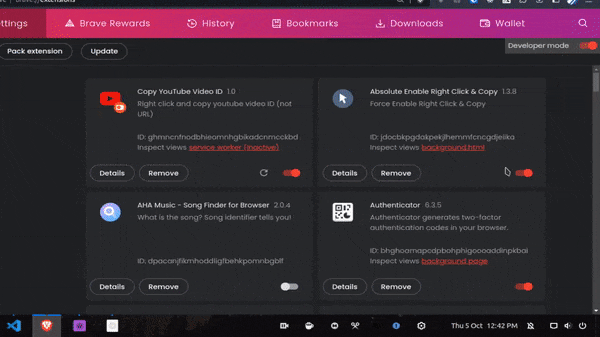

> Read [**Thoughts from the Creator**](https://github.com/prakhartiwari0/my-web-shortcuts/discussions/12) Announcement - 14 October 2023

<!--  -->
<h2 align="center">
<a href="https://youtu.be/x_fYfporwmA"> DEMO VIDEO IS OUT! ✨🔥</a>

   
</h2>


<h1 align="center"> My Web Shortcuts 🌐 </h1>

[](code_of_conduct.md)

A Browser Extension to create custom keyboard shortcuts for any website you browse. 

# How to use it
1. Click on the extension icon in the toolbar.
2. Select an element to set the shortcut for.
3. Now select the keyboard key to use in order to click on that element.
4. Reload the website and now you will be able to click on that element just by pressing the shortcut key that you have set. 

> <a href="https://youtu.be/x_fYfporwmA" align="center"> First Demo of My Web Shortcuts + Invitation to Contributors! </a>


# How to Install the extension

> Note: Only Chromium-based browsers like Google Chrome & Brave are supported currently.

<details>
<summary>
Show the Steps
</summary>


1. Clone the repository & Open the folder
   ```bash
   git clone "https://github.com/prakhartiwari0/my-web-shortcuts" && cd my-web-shortcuts
   ```
2. Install the Packages using NPM
    ```bash
    npm i
    ```
3. Start the Development Server
    ```bash
    npm run dev
    ```
4. Drag and upload the newly generated `dist` folder into your Browser
   
5. The extension is now installed in the browser, but you need to reload the website to use it. 


</details>


## Features to work on


### Type of **Element/Location Selection for a Keyboard Shortcut**
One can select a single or multiple elements or a location(x,y) on the webpage with a single keyboard shortcut attached to it. 


- `singleElement` Single Element Clicking: Simply Select an Element to click on.
  - `conditionally` Click Conditionally: 
    - 1. `otherElementExists` Click on this Element if some other Element exists.
    - 2. `otherElementDoesNotExist` Click on this Element if some other Element doesn't exists.

- `multiElements` Multiple Elements Selection: Select multiple elements to click on one by one from the first to the last.
   - `atIntervals` Select Elements to click in series at desired intervals
   - `similar` Select Elements to click/focus on all the similar Elements one by one, shift click to reverse (e.g. Google result links, Discord users list etc.)
   - `conditionally` Select Elements to click conditionally:
     - 1. `currentElementDoesNotExist` Click on Next Element if the current Element doesn't exist.
     - 2. `currentElementNotClickable` Click on Next Element if the current Element isn't clickable.
- `locateElement` Location Selection: Click on the element that exists on the Coordinates.
